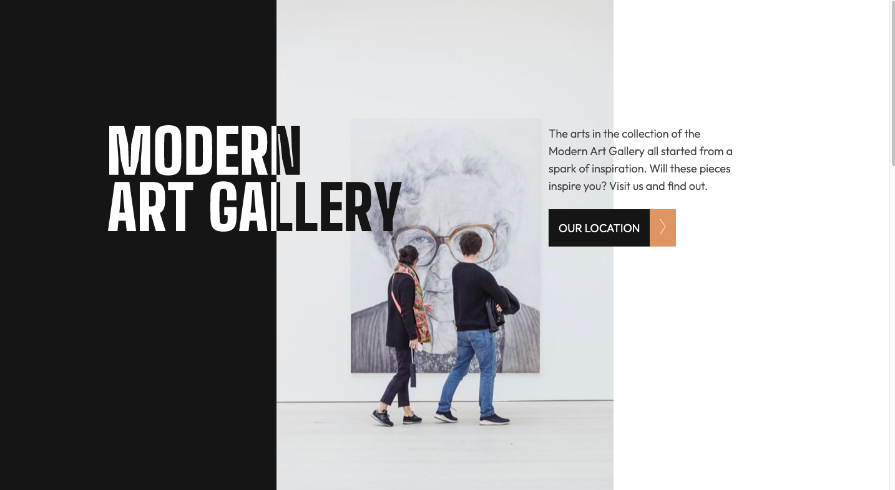

# Frontend Mentor - Art gallery website solution

This is a solution to the [Art gallery website challenge on Frontend Mentor](https://www.frontendmentor.io/challenges/art-gallery-website-yVdrZlxyA). Frontend Mentor challenges help you improve your coding skills by building realistic projects.

## Table of contents

-  [Overview](#overview)
   -  [The challenge](#the-challenge)
   -  [Screenshot](#screenshot)
   -  [Links](#links)
-  [My process](#my-process)
   -  [Built with](#built-with)
   -  [What I learned](#what-i-learned)
   -  [Continued development](#continued-development)
-  [Author](#author)

## Overview

### Requirements

Users should be able to:

-  View the optimal layout for each page depending on their device's screen size
-  See hover states for all interactive elements throughout the site
-  **Bonus**: Use [Leaflet JS](https://leafletjs.com/) to create an interactive location map with custom location pin

### Screenshot

### Links

-  Solution URL: [Add solution URL here](https://github.com/jacksonwhiting/art-gallery-website)
-  Live Site URL: [Add live site URL here](https://your-live-site-url.com)

## My process

### Built with

-  Semantic HTML5 markup
-  CSS custom properties
-  Flexbox
-  CSS Grid
-  Mobile-first workflow
-  [Tailwind CSS](https://tailwindcss.com/) - CSS Utility Library

### What I learned

The biggest challenge for me was the two toned logo. I'm sure there are many ways to skin this cat so I'm looking forward to seeing how other's solved the problem.

Though I didn't necessarily need to use an image mask, this is the path I went down and it forced me to learn how to use masks, which is a powerful tools!

### Continued development

I'd like to continue learning how to leverage masks and clips to add creative animations. I'm also going to start working on projects involving vanilla javascript.

## Author

-  Frontend Mentor - [@jacksonwhiting](https://www.frontendmentor.io/profile/jacksonwhiting)
-  Twitter - [@JWhiting00](https://www.twitter.com/JWhiting0)
   you'd like to share.\*\*
